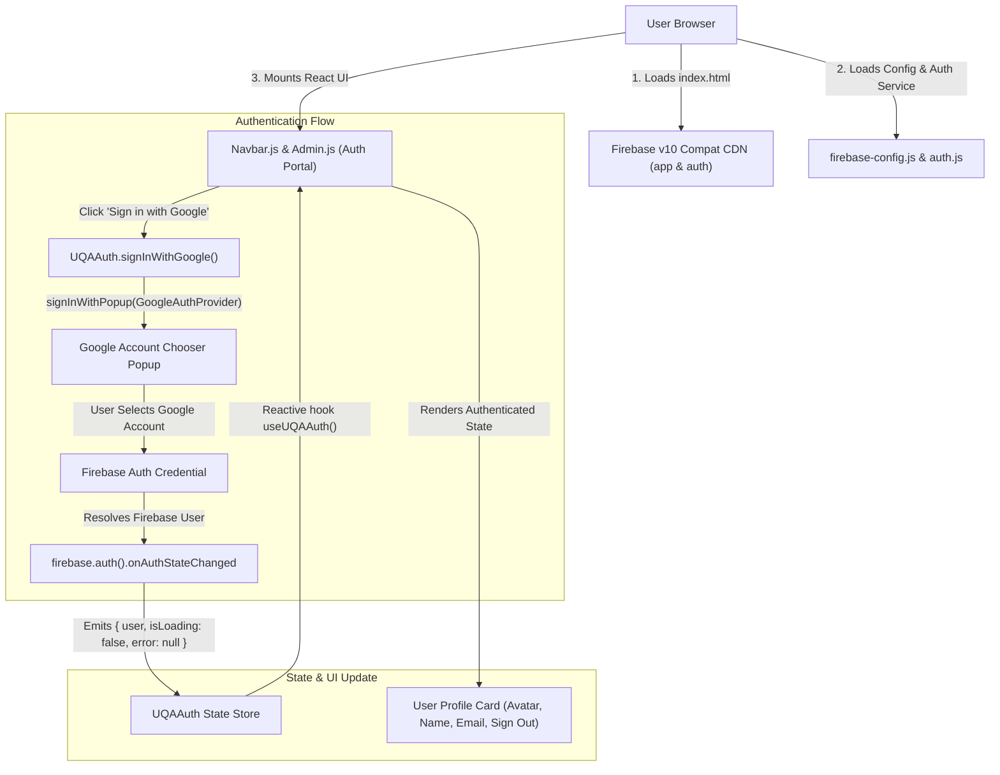
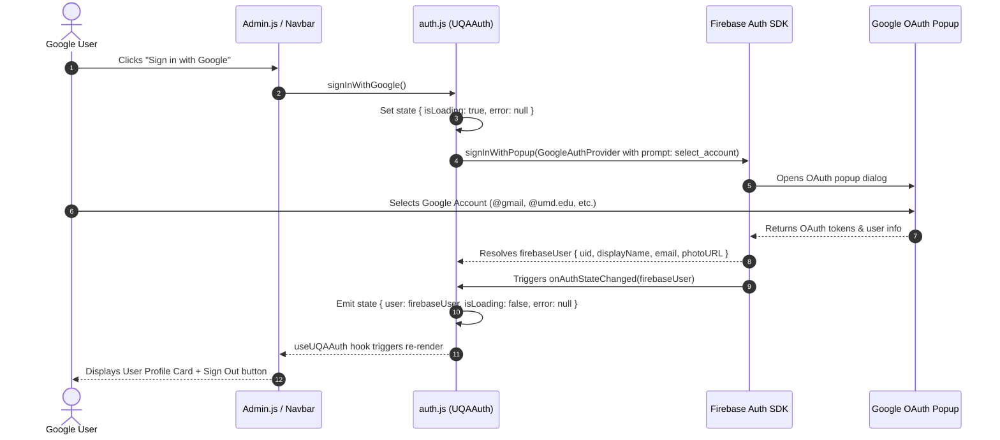

# Plan: Pure Google Authentication Integration

## Scope & Objective
Integrate pure Google Sign-In into the UMD UQA web portal using the standard Firebase v10 Compat Auth SDK (`firebase.auth().signInWithPopup`). Enable any valid Google user (@gmail.com, @terpmail.umd.edu, @umd.edu, etc.) to authenticate seamlessly, view their user profile card, persist sessions across page reloads, and sign out cleanly. Zero mock prompt hacks, zero `window.prompt` dialogs, zero `localStorage` mock email bypasses.

---

### In Scope
1. **Firebase Auth Service Core (`auth.js`)**:
   - `signInWithGoogle()`: Trigger `firebase.auth().signInWithPopup(new firebase.auth.GoogleAuthProvider())` with `setCustomParameters({ prompt: 'select_account' })`.
   - `signOut()`: Call `firebase.auth().signOut()`.
   - `onAuthStateChanged`: Single source of truth for session lifecycle and persistence.
   - Clean state model: `{ user: { uid, displayName, email, photoURL } | null, isLoading: boolean, error: string | null }`.
   - Custom hook `useUQAAuth()` for reactive UI bindings.
   - Complete removal of demo `window.prompt` dialogs and mock user generation.
2. **Configuration Validation Layer (`firebase-config.js`)**:
   - `window.isFirebaseConfigured()` validation helper.
   - Non-blocking setup alert when placeholder keys are detected.
3. **User Interface Lifecycle (`Admin.js` / Auth Portal)**:
   - **Guest / Unauthenticated View**: Clean centered card with official "Sign in with Google" button (with Google SVG icon), loading spinner, and dismissible error banner.
   - **Authenticated View**: User Profile Card rendering Google avatar (`photoURL`), display name (`displayName`), email address (`email`), and "Sign Out" button.
   - **Error Handling**: Dismissible banner displaying friendly error messages for popup closure, blocker, or network failure.
4. **Navbar Authentication State Binding (`Navbar.js`)**:
   - Guest: Displays "Sign In" / "Login" button navigating to auth portal.
   - Authenticated: Displays user avatar / display name and active status indicator.
5. **Firebase Console & Authorized Domains Setup Guide**:
   - Step-by-step instructions for enabling Google Sign-In method.
   - Whitelisting `localhost`, `127.0.0.1`, and `umd-uqa.github.io`.
6. **Git Worktree Isolation**:
   - T0 worktree creation on `feature/google-auth` branch; final cleanup on completion.

### Out of Scope
- Role-based authorization, administrator gates, or CMS whitelisting (pure authentication: ANY valid Google user can sign in).
- Backend Node.js / SSR servers (preserves static GitHub Pages client architecture).
- Bundlers (Webpack, Vite, npm build scripts) — uses zero-build CDN Babel architecture.
- Third-party GIS library (`gsi/client`) — uses standard Firebase v10 Compat Auth popup flow.

---

## Architecture & Data Flow

### 1. High-Level Architecture


### 2. Authentication Sequence Flow


---

## Data Schemas & Configurations

### 1. Firebase Configuration (`firebase-config.js`)
```javascript
window.UQA_FIREBASE_CONFIG = {
  apiKey: "YOUR_FIREBASE_API_KEY",
  authDomain: "YOUR_PROJECT_ID.firebaseapp.com",
  projectId: "YOUR_PROJECT_ID",
  storageBucket: "YOUR_PROJECT_ID.appspot.com",
  messagingSenderId: "YOUR_MESSAGING_SENDER_ID",
  appId: "YOUR_APP_ID"
};

window.isFirebaseConfigured = function() {
  const cfg = window.UQA_FIREBASE_CONFIG;
  return Boolean(
    cfg &&
    cfg.apiKey &&
    cfg.apiKey !== "YOUR_FIREBASE_API_KEY" &&
    cfg.projectId &&
    cfg.projectId !== "YOUR_PROJECT_ID"
  );
};
```

### 2. Auth State Shape (`window.UQAAuth.getState()`)
```javascript
{
  user: {
    uid: "firebase_user_uid_12345",
    displayName: "Jane Doe",
    email: "janedoe@terpmail.umd.edu",
    photoURL: "https://lh3.googleusercontent.com/a/..."
  }, // null when unauthenticated
  isLoading: false, // boolean
  error: null // string error message or null
}
```

---

## Firebase Console & Authorized Domains Setup Guide

### Step 1: Enable Google Sign-In Provider
1. Open [Firebase Console](https://console.firebase.google.com/).
2. Select your Firebase project (or create `umd-uqa-web`).
3. Navigate to **Build** > **Authentication** > **Sign-in method**.
4. Click on **Google** under Additional providers.
5. Toggle **Enable**.
6. Set **Project public-facing name** to `UMD UQA`.
7. Select a valid **Project support email** from the dropdown.
8. Click **Save**.

### Step 2: Configure Authorized Domains
1. In Firebase Console, go to **Authentication** > **Settings** tab.
2. Click **Authorized domains**.
3. Verify and add the following domains:
   - `localhost`
   - `127.0.0.1`
   - `umd-uqa.github.io`
   - `<YOUR_PROJECT_ID>.firebaseapp.com`
   - `<YOUR_PROJECT_ID>.web.app`

### Step 3: Populate Web App Keys
1. Go to **Project settings** (gear icon) > **General** > **Your apps** > **Web app**.
2. Copy the `firebaseConfig` object values into `firebase-config.js`.

---

## Tasks

### T0: Create isolated git worktree
- **Deps**: None
- **Est. Time**: 3 min
- **Files**: None
- **Action**:
  - Caveman: Run `git worktree add ../worktree-google-auth -b feature/google-auth`. Switch directory to `../worktree-google-auth`.
  - Verify clean working tree on isolated branch.
- **Acceptance Criteria**:
  - `git worktree list` displays `../worktree-google-auth` on branch `feature/google-auth`.
- **Tests**:
  - *Happy*: Worktree directory created and accessible.
  - *Error*: Fails cleanly if branch or directory already exists.

---

### T1: Verify Firebase Compat SDK dependencies & script load order (`index.html`)
- **Deps**: T0
- **Est. Time**: 10 min
- **Files**:
  - `index.html`
- **Action**:
  - Caveman: Check and verify `<head>` includes Firebase v10 Compat CDN scripts:
    ```html
    <script src="https://www.gstatic.com/firebasejs/10.8.0/firebase-app-compat.js"></script>
    <script src="https://www.gstatic.com/firebasejs/10.8.0/firebase-auth-compat.js"></script>
    <script src="https://www.gstatic.com/firebasejs/10.8.0/firebase-firestore-compat.js"></script>
    <script src="https://www.gstatic.com/firebasejs/10.8.0/firebase-storage-compat.js"></script>
    ```
  - Ensure script execution sequence:
    1. React 18 & ReactDOM
    2. Babel Standalone & Tailwind CDN
    3. Firebase Compat CDN scripts (`app`, `auth`, `firestore`, `storage`)
    4. `firebase-config.js`
    5. `auth.js`
    6. `seed-data.js`
    7. UI Components (`Navbar.js`, `Home.js`, `About.js`, `Events.js`, `Contact.js`, `Calendar.js`, `Resources.js`, `Admin.js`)
    8. `App.js`
- **Acceptance Criteria**:
  - `index.html` loads Firebase App and Auth SDKs in correct order before `firebase-config.js` and `auth.js`.
- **Tests**:
  - *Happy*: Page loads; `window.firebase` and `window.firebase.auth` defined in browser console.
  - *Error*: Missing script causes no syntax/parse crash on remaining static components.

---

### T2: Firebase configuration validation & status helper (`firebase-config.js`)
- **Deps**: T1
- **Est. Time**: 10 min
- **Files**:
  - `firebase-config.js`
- **Action**:
  - Caveman: Update `firebase-config.js` to ensure clean placeholder structure and validation helper `window.isFirebaseConfigured()`.
  - Initialize Firebase app and services safely:
    ```javascript
    if (window.isFirebaseConfigured()) {
      if (!window.firebase.apps.length) {
        window.firebase.initializeApp(window.UQA_FIREBASE_CONFIG);
      }
      window.uqaAuth = window.firebase.auth();
    }
    ```
  - Provide non-blocking informational console logs when running in unconfigured mode.
- **Acceptance Criteria**:
  - `window.isFirebaseConfigured()` returns `false` for default placeholder keys and `true` when valid credentials are set.
  - `window.uqaAuth` initialized when configured.
- **Tests**:
  - *Happy*: Placeholder configuration returns `false` without throwing exceptions.
  - *Edge*: Populated valid configuration initializes `window.uqaAuth` correctly.

---

### T3: Refactor Auth Service for pure Firebase Google Auth (`auth.js`)
- **Deps**: T2
- **Est. Time**: 25 min
- **Files**:
  - `auth.js`
- **Action**:
  - Caveman: Rewrite `auth.js`. Eliminate all mock code (`window.prompt`, `uqa_mock_user_email`, fake admin checks).
  - Implement pure Google Sign-In service `window.UQAAuth`:
    - `getState()`: Returns current `{ user, isLoading, error }`.
    - `subscribe(callback)`: Registers listener and returns unsubscribe function.
    - `signInWithGoogle()`:
      - Emit `{ isLoading: true, error: null }`.
      - Guard check: if `!window.isFirebaseConfigured()`, emit error "Firebase configuration required. Please update firebase-config.js" and return.
      - Create provider: `const provider = new window.firebase.auth.GoogleAuthProvider();`
      - Set custom parameter: `provider.setCustomParameters({ prompt: 'select_account' });`
      - Call `await window.uqaAuth.signInWithPopup(provider)`.
      - Catch errors, format friendly error string (handling popup blocked, popup closed, unauthorized domain), and emit `{ isLoading: false, error }`.
    - `signOut()`:
      - Emit `{ isLoading: true }`.
      - Call `await window.uqaAuth.signOut()`.
      - Emit `{ user: null, isLoading: false, error: null }`.
  - Attach listener `window.uqaAuth.onAuthStateChanged`:
    - When `firebaseUser` present: emit `{ user: { uid, displayName, email, photoURL }, isLoading: false, error: null }`.
    - When `firebaseUser` null: emit `{ user: null, isLoading: false, error: null }`.
  - Export React hook `window.useUQAAuth()` for seamless component state subscription.
- **Acceptance Criteria**:
  - No `window.prompt` dialogs or mock auto-login code exist in codebase.
  - Calling `signInWithGoogle()` triggers Google popup with account selector.
  - Any valid Google account populates `user` with profile data (`uid`, `displayName`, `email`, `photoURL`).
  - Page refresh retains authenticated session automatically.
  - `signOut()` clears user session and emits `user: null`.
- **Tests**:
  - *Happy*: Sign in with Google account succeeds -> user profile populated.
  - *Happy*: Sign out clears user state to `null`.
  - *Edge*: User closes popup dialog -> caught cleanly, error state updated, no crash.
  - *Error*: Unconfigured Firebase keys -> friendly error displayed without throwing unhandled promise rejection.

---

### T4: Build User Profile Card & Sign-In UI (`Admin.js`)
- **Deps**: T3
- **Est. Time**: 25 min
- **Files**:
  - `Admin.js`
- **Action**:
  - Caveman: Update `Admin.js` (Auth Portal view) to support clean unauthenticated guest view, dismissible error alerts, and authenticated User Profile Card.
  - **Guest / Unauthenticated View (`!auth.user`)**:
    - Render centered auth card in portal.
    - Title: "UMD UQA Sign In".
    - Description: "Sign in with your Google account (@gmail.com, @terpmail.umd.edu, @umd.edu) to access your profile."
    - Dismissible Error Banner: If `auth.error` present, show red alert box with message and close button.
    - Unconfigured Warning: If `!window.isFirebaseConfigured()`, show amber notice with guidance to update `firebase-config.js`.
    - "Sign in with Google" Button:
      - Full-width button with official Google "G" multicolor SVG icon.
      - Displays "Signing In..." spinner when `auth.isLoading` is true.
      - Click handler calls `auth.signInWithGoogle()`.
  - **Authenticated View (`auth.user`)**:
    - Render User Profile Card:
      - User Avatar: Google profile picture (`auth.user.photoURL`) with fallback initials.
      - Display Name: `auth.user.displayName` (or "Google User").
      - Email: `auth.user.email`.
      - Status Badge: "Google Authenticated" green badge.
      - User ID: Truncated `auth.user.uid` in monospace.
      - "Sign Out" Button: Calling `auth.signOut()` to clear session.
- **Acceptance Criteria**:
  - Unauthenticated users see clean Google Sign-In card with SVG icon.
  - Clicking sign-in opens Google account picker popup.
  - Authenticated users see rich User Profile Card with photo, name, email, and working Sign Out button.
  - Errors are dismissible and clearly explained.
- **Tests**:
  - *Happy*: Guest visits portal -> sees Google button -> signs in -> profile card shows accurate photo and email.
  - *Happy*: Authenticated user clicks Sign Out -> UI returns to guest sign-in button.
  - *Edge*: User without profile photo displays initials placeholder avatar.
  - *Error*: Popup closed by user displays dismissible alert banner.

---

### T5: Bind Navbar authentication indicator (`Navbar.js`)
- **Deps**: T4
- **Est. Time**: 15 min
- **Files**:
  - `Navbar.js`
- **Action**:
  - Caveman: Update `Navbar.js` to reflect live Google auth state.
  - In `Navbar.js`:
    - Consume `const auth = window.useUQAAuth ? window.useUQAAuth() : { user: null };`
    - When unauthenticated (`!auth.user`): Show "Sign In" button leading to `#admin` (or portal view).
    - When authenticated (`auth.user`):
      - Show user avatar thumbnail or name pill with green online dot.
      - Clicking navigates to `#admin` to view user profile.
- **Acceptance Criteria**:
  - Navbar dynamically updates immediately upon sign-in and sign-out without requiring page reload.
- **Tests**:
  - *Happy*: Guest sees "Sign In" -> after Google login, Navbar shows user avatar / name + green indicator.
  - *Happy*: Clicking Sign Out in profile immediately reverts Navbar to "Sign In".

---

### T6: End-to-End Verification Protocol
- **Deps**: T1, T2, T3, T4, T5
- **Est. Time**: 20 min
- **Files**:
  - `index.html`
  - `firebase-config.js`
  - `auth.js`
  - `Admin.js`
  - `Navbar.js`
- **Action**:
  - Caveman: Serve app locally (`python3 -m http.server 8000`). Execute 5-step verification test matrix:
    1. **Cold Load**: Open `http://localhost:8000/#admin` in clean/incognito browser. Verify clean "Sign in with Google" button with SVG logo renders. Zero mock prompts.
    2. **Popup Trigger**: Click "Sign in with Google". Verify Google account chooser popup opens with account selector.
    3. **Sign In**: Select ANY Google account (@gmail.com, @terpmail.umd.edu, @umd.edu). Verify popup closes, login succeeds, and User Profile Card displays avatar, display name, and email address.
    4. **Session Persistence**: Press `F5` / reload browser page. Verify session persists automatically without re-prompting login.
    5. **Sign Out**: Click "Sign Out" button on profile card. Verify session clears immediately and UI reverts to "Sign in with Google" button.
- **Acceptance Criteria**:
  - All 5 verification steps pass cleanly with zero console errors or broken UI states.
- **Tests**:
  - *Happy*: Steps 1-5 pass end-to-end.
  - *Edge*: Popup cancellation handled gracefully with dismissible error alert.

---

### T7: Commit changes, documentation & worktree cleanup
- **Deps**: T6
- **Est. Time**: 10 min
- **Files**:
  - All modified codebase files
- **Action**:
  - Caveman: In worktree directory, stage and commit changes:
    `git add . && git commit -m "feat(auth): integrate pure google sign-in with firebase compat auth sdk"`
  - Switch back to main repository root: `cd /home/bobjoe/IdeaProjects/umd-uqa.github.io`
  - Clean up worktree: `git worktree remove ../worktree-google-auth`
- **Acceptance Criteria**:
  - Clean commit on `feature/google-auth`.
  - Worktree removed cleanly.
- **Tests**:
  - *Happy*: `git worktree list` confirms worktree cleaned up; repository clean.

---

## Error Scenarios & Resiliency Matrix

| Error Scenario | Root Cause | Detection Point | Automated Recovery / UI Mitigation |
| :--- | :--- | :--- | :--- |
| **Popup Closed by User (`auth/popup-closed-by-user`)** | User closes popup window before completing Google sign-in | `signInWithPopup` promise rejection | Catch error, reset `isLoading: false`, display dismissible info banner: "Sign-in window closed before completing authentication." |
| **Popup Blocked (`auth/popup-blocked`)** | Browser popup blocker prevents popup window | `signInWithPopup` rejection | Surface clear banner: "Sign-in popup was blocked by your browser. Please allow popups for this site and try again." |
| **Unauthorized Domain (`auth/unauthorized-domain`)** | Current domain not in Firebase Authorized Domains list | `signInWithPopup` rejection | Show banner: "Domain unauthorized: Add this domain (e.g. localhost or umd-uqa.github.io) to Firebase Console > Authentication > Settings > Authorized Domains." |
| **Network Failure (`auth/network-request-failed`)** | User loses internet connection during OAuth handshake | Network fetch rejection | Show banner: "Network error encountered during sign-in. Please check your internet connection and retry." |
| **Missing Firebase Configuration** | Placeholder keys in `firebase-config.js` | `window.isFirebaseConfigured()` check | Prevent broken network calls; render warning card explaining how to populate `firebase-config.js`. |

---

## Verification Test Matrix

| Step | Test Scenario | Action / Input | Expected Result | Pass Criteria |
| :--- | :--- | :--- | :--- | :--- |
| **Step 1** | Cold Guest Load | Open `http://localhost:8000/#admin` in fresh browser | Clean "Sign in with Google" button with Google SVG logo renders. Zero mock dialogs. | `auth.user === null`, Sign-in button visible |
| **Step 2** | Popup Trigger | Click "Sign in with Google" button | Google OAuth popup opens displaying Google account chooser (`prompt: select_account`). | Popup window opens to `accounts.google.com` |
| **Step 3** | Google Account Login | Select ANY valid Google account (@gmail, @umd.edu, etc.) | Popup closes, user authenticated, User Profile Card renders photo, name, email. | `auth.user !== null`, `email` and `photoURL` displayed in profile card |
| **Step 4** | Session Persistence | Press `F5` / Refresh page | `onAuthStateChanged` restores session automatically without re-prompt. | Profile card visible immediately after reload (<500ms) |
| **Step 5** | Sign-Out Flow | Click "Sign Out" button on profile card | Session terminates, UI immediately resets to "Sign in with Google". | `auth.user === null`, Sign-in button visible, Navbar updated |
| **Step 6 (Edge)** | Popup Dismissal | Open popup and close window manually | Error banner displayed without breaking UI layout. | Dismissible error banner visible, `isLoading === false` |

---

## Risks & Mitigation

| Risk | Impact | Mitigation Strategy |
| :--- | :--- | :--- |
| **Browser Popup Blocker** | Medium | Catch `auth/popup-blocked` error code and display explicit helper instruction guiding user to allow popups. |
| **Missing Authorized Domain on Deployment** | High | Include explicit checklist and troubleshooting guide in plan for adding `localhost`, `127.0.0.1`, and `umd-uqa.github.io` in Firebase Console. |
| **Account Chooser Skipped** | Low | `provider.setCustomParameters({ prompt: 'select_account' })` forces account selector every time so users can switch accounts. |
| **Missing Avatar / Display Name in Google Profile** | Low | Provide fallback initials circle and default fallback username ("Google User") if Google profile fields are empty. |
| **Zero-Build Architecture Integrity** | Medium | Use standard Firebase v10 Compat CDN scripts without adding Node.js bundlers or npm dependencies. |
