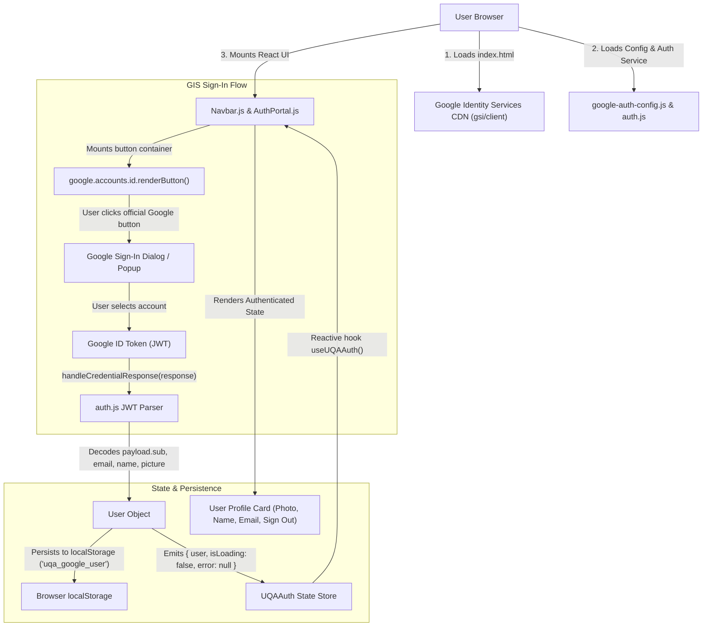
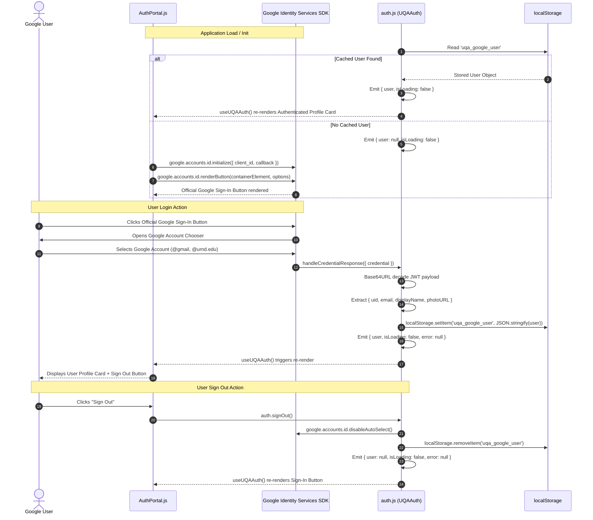

# Plan: Pure Google Identity Services (GIS) Authentication Integration

## Scope & Objective
Eliminate all Firebase SDKs, configurations, and backend dependencies. Integrate pure client-side Google Identity Services (GIS) SDK (`https://accounts.google.com/gsi/client`) into UMD UQA web application. Enable any Google account user (@gmail.com, @terpmail.umd.edu, @umd.edu) to authenticate via official Google Sign-In button or One Tap, decode client-side JWT ID token, persist user session across page reloads via `localStorage`, and cleanly sign out.

---

### In Scope
1. **Zero Firebase Elimination**:
   - Remove Firebase v10 Compat SDK CDN script tags (`firebase-app-compat.js`, `firebase-auth-compat.js`) from `index.html`.
   - Remove `firebase-config.js` and delete all Firebase object references across all components.
   - Eliminate all Firebase database/server requirements.
2. **Google Identity Services (GIS) Core Integration**:
   - Asynchronously load Google Identity Services SDK (`https://accounts.google.com/gsi/client`) in `index.html`.
   - Create `google-auth-config.js` defining `window.UQA_GOOGLE_CLIENT_ID` and configuration validator `window.isGoogleAuthConfigured()`.
   - Initialize GIS via `google.accounts.id.initialize({ client_id, callback, auto_select })`.
   - Render official Google Sign-In button into DOM container via `google.accounts.id.renderButton()`.
   - Optional One Tap prompt trigger `google.accounts.id.prompt()`.
3. **Client-Side JWT Decoding & Session Management (`auth.js`)**:
   - Safe Base64URL JWT payload parser supporting UTF-8 decoding.
   - User profile extractor: `user = { uid: payload.sub, email: payload.email, displayName: payload.name, photoURL: payload.picture }`.
   - Persistent session storage in `localStorage` (`uqa_google_user`).
   - Auto-restore user session on cold start / page reload (`F5`).
   - Clean `signOut()`: clear `localStorage`, call `google.accounts.id.disableAutoSelect()`, and emit `user: null`.
   - React Hook `useUQAAuth()` providing `{ user, isLoading, error, signOut, renderGoogleButton }`.
4. **UI Presentation & Routing**:
   - `AuthPortal.js`:
     - Unauthenticated View: Container rendering official Google Sign-In button, loading state, dismissible error banner, and Google Cloud Console setup guide when unconfigured.
     - Authenticated View: User Profile Card displaying Google photo avatar, name, email, Google OAuth session badge, and Sign Out button.
   - `Navbar.js`: Dynamic auth indicator displaying "Sign In" button when logged out, or user thumbnail avatar + name + live status pill when logged in.
   - `App.js`: Routing for `#auth`, `#login`, and `#admin` pointing to `AuthPortal`.
5. **Google Cloud Console Setup Documentation**:
   - Step-by-step instructions for OAuth Consent Screen, OAuth 2.0 Client ID (Web Application), and Authorized JavaScript Origins (`localhost:8000`, `127.0.0.1:8000`, `umd-uqa.github.io`).
   - Update `README.md` to reflect pure GIS architecture.
6. **Git Worktree Isolation**:
   - T0 worktree creation on `feature/google-auth` branch; final cleanup on completion.

### Out of Scope
- Backend server / database verification (Node.js, Express, Go, Python).
- Firebase Auth, Firestore, or Cloud Storage services.
- Role-based authorization or CMS admin whitelisting (pure authentication for any valid Google account).
- Node.js bundlers (Webpack, Vite, npm scripts) — maintains zero-build CDN Babel architecture.

---

## Architecture & Data Flow

### 1. High-Level Architecture


### 2. Authentication Sequence Flow


---

## Data Schemas & Configurations

### 1. Google Auth Configuration (`google-auth-config.js`)
```javascript
/**
 * UMD UQA Google Identity Services (GIS) Configuration
 * Configure OAuth 2.0 Web Client ID from Google Cloud Console.
 */
window.UQA_GOOGLE_CLIENT_ID = "YOUR_GOOGLE_CLIENT_ID.apps.googleusercontent.com";

/**
 * Check if Google OAuth Client ID is configured
 */
window.isGoogleAuthConfigured = function() {
  const cid = window.UQA_GOOGLE_CLIENT_ID;
  return Boolean(
    cid &&
    typeof cid === "string" &&
    cid.trim() !== "" &&
    !cid.includes("YOUR_GOOGLE_CLIENT_ID") &&
    cid.endsWith(".apps.googleusercontent.com")
  );
};
```

### 2. Decoded JWT Payload Schema (Google ID Token)
```javascript
{
  "iss": "https://accounts.google.com",
  "sub": "118234567890123456789", // Google unique user ID
  "azp": "YOUR_GOOGLE_CLIENT_ID.apps.googleusercontent.com",
  "aud": "YOUR_GOOGLE_CLIENT_ID.apps.googleusercontent.com",
  "email": "janedoe@terpmail.umd.edu",
  "email_verified": true,
  "name": "Jane Doe",
  "picture": "https://lh3.googleusercontent.com/a/...",
  "given_name": "Jane",
  "family_name": "Doe",
  "iat": 1756000000,
  "exp": 1756003600
}
```

### 3. Application User State Shape (`auth.js`)
```javascript
{
  user: {
    uid: "118234567890123456789",
    displayName: "Jane Doe",
    email: "janedoe@terpmail.umd.edu",
    photoURL: "https://lh3.googleusercontent.com/a/..."
  }, // null when unauthenticated
  isLoading: false, // boolean
  error: null // string error message or null
}
```

### 4. LocalStorage Session Key
- Key: `'uqa_google_user'`
- Value: `JSON.stringify(user)`

---

## Step-by-Step Google Cloud Console Setup Guide

### Step 1: Create or Select Google Cloud Project
1. Navigate to [Google Cloud Console](https://console.cloud.google.com/).
2. Click the project dropdown at top left and select **New Project**.
3. Name the project `umd-uqa-web` (or select existing project) and click **Create**.

### Step 2: Configure OAuth Consent Screen
1. In the left navigation menu, go to **APIs & Services** > **OAuth consent screen**.
2. Select User Type: **External** and click **Create**.
3. Fill in required App Information:
   - **App name**: `UMD UQA`
   - **User support email**: Select your email.
   - **Developer contact information**: Enter your email.
4. Click **Save and Continue** through Scopes (default `email`, `profile`, `openid` are selected).
5. Under **Test users**, add your testing Google accounts (e.g., `@gmail.com` or `@terpmail.umd.edu`), then click **Save and Continue**.

### Step 3: Create OAuth 2.0 Web Client ID
1. Navigate to **APIs & Services** > **Credentials**.
2. Click **+ CREATE CREDENTIALS** at the top and select **OAuth client ID**.
3. Set Application type to **Web application**.
4. Set Name to `UMD UQA Web Client`.
5. Under **Authorized JavaScript origins**, click **+ ADD URI** and add:
   - `http://localhost:8000`
   - `http://127.0.0.1:8000`
   - `https://umd-uqa.github.io`
6. Click **Create**.
7. Copy the generated **Client ID** (format: `xxxxxxxxxxxx-xxxxxxxxxxxxxxxxxxxxxxxx.apps.googleusercontent.com`).

### Step 4: Populate Client ID in Codebase
1. Open `google-auth-config.js`.
2. Replace `"YOUR_GOOGLE_CLIENT_ID.apps.googleusercontent.com"` with your actual Google Client ID.

---

## Tasks

### T0: Create isolated git worktree
- **Deps**: None
- **Est. Time**: 3 min
- **Files**: None
- **Action**:
  - Caveman: Make new worktree for google auth work. Run `git worktree add ../worktree-google-auth -b feature/google-auth`. Switch directory to `../worktree-google-auth`.
  - Verify clean working tree on isolated branch.
- **Acceptance Criteria**:
  - `git worktree list` displays `../worktree-google-auth` on branch `feature/google-auth`.
- **Tests**:
  - *Happy*: Worktree directory created and accessible.
  - *Error*: Fails cleanly if branch or directory already exists.

---

### T1: Update HTML dependencies & strip Firebase SDKs (`index.html`)
- **Deps**: T0
- **Est. Time**: 10 min
- **Files**:
  - `index.html`
- **Action**:
  - Caveman: Edit `index.html`. Delete all Firebase script tags (`firebase-app-compat.js`, `firebase-auth-compat.js`).
  - Add Google Identity Services SDK script tag in `<head>`:
    ```html
    <!-- Google Identity Services (GIS) SDK -->
    <script src="https://accounts.google.com/gsi/client" async defer></script>
    ```
  - In `<body>`, replace `<script type="text/babel" src="./firebase-config.js"></script>` with:
    ```html
    <!-- Google Auth Config & Authentication Layer -->
    <script type="text/babel" src="./google-auth-config.js"></script>
    <script type="text/babel" src="./auth.js"></script>
    ```
  - Ensure clean script loading sequence:
    1. React 18 & ReactDOM UMD
    2. Babel Standalone & Tailwind CDN
    3. Google Identity Services SDK (`gsi/client`)
    4. `google-auth-config.js`
    5. `auth.js`
    6. UI Components (`Navbar.js`, `Home.js`, `About.js`, `Events.js`, `Contact.js`, `Calendar.js`, `Resources.js`, `AuthPortal.js`)
    7. `App.js`
- **Acceptance Criteria**:
  - Zero Firebase script tags in `index.html`.
  - GIS SDK and `google-auth-config.js` loaded in correct order.
- **Tests**:
  - *Happy*: Open `index.html` in browser; `google.accounts.id` API is accessible on window load.
  - *Error*: No 404 network errors for missing Firebase scripts in browser network panel.

---

### T2: Create `google-auth-config.js` and delete `firebase-config.js`
- **Deps**: T1
- **Est. Time**: 10 min
- **Files**:
  - `google-auth-config.js`
  - `firebase-config.js` (delete)
- **Action**:
  - Caveman: Create `google-auth-config.js`. Define `window.UQA_GOOGLE_CLIENT_ID = "YOUR_GOOGLE_CLIENT_ID.apps.googleusercontent.com"`.
  - Implement `window.isGoogleAuthConfigured()` helper checking for non-placeholder valid client ID ending in `.apps.googleusercontent.com`.
  - Delete `firebase-config.js` file from filesystem.
- **Acceptance Criteria**:
  - `google-auth-config.js` exists and sets `window.UQA_GOOGLE_CLIENT_ID`.
  - `window.isGoogleAuthConfigured()` returns `false` on placeholder and `true` on valid Client ID.
  - `firebase-config.js` completely deleted.
- **Tests**:
  - *Happy*: Placeholder configuration returns `false` safely without exceptions.
  - *Edge*: String with spaces or missing suffix returns `false`.

---

### T3: Implement Pure GIS Auth Service & JWT decoder (`auth.js`)
- **Deps**: T2
- **Est. Time**: 25 min
- **Files**:
  - `auth.js`
- **Action**:
  - Caveman: Rewrite `auth.js` with pure GIS authentication and zero Firebase code.
  - Implement UTF-8 safe JWT payload decoder:
    ```javascript
    function parseJwt(token) {
      const base64Url = token.split('.')[1];
      const base64 = base64Url.replace(/-/g, '+').replace(/_/g, '/');
      const jsonPayload = decodeURIComponent(
        atob(base64)
          .split('')
          .map(c => '%' + ('00' + c.charCodeAt(0).toString(16)).slice(-2))
          .join('')
      );
      return JSON.parse(jsonPayload);
    }
    ```
  - Implement `window.UQAAuth` service:
    - `_state`: `{ user: null, isLoading: true, error: null }`.
    - `getState()`: Returns current state.
    - `subscribe(callback)`: Adds listener, fires immediately with current state, returns unsubscribe function.
    - `_emit(newState)`: Updates state and notifies subscribers.
    - `_initSession()`: On script load, check `localStorage.getItem('uqa_google_user')`. If valid JSON found, emit `{ user: parsedUser, isLoading: false, error: null }`. Else emit `{ user: null, isLoading: false, error: null }`.
    - `handleCredentialResponse(response)`:
      - Extract `response.credential`.
      - Decode payload via `parseJwt`.
      - Construct user: `{ uid: payload.sub, email: payload.email, displayName: payload.name || payload.email.split('@')[0], photoURL: payload.picture || "https://www.gravatar.com/avatar/?d=mp" }`.
      - `localStorage.setItem('uqa_google_user', JSON.stringify(user))`.
      - Emit `{ user, isLoading: false, error: null }`.
    - `initGIS(buttonContainerId)`:
      - If `!window.isGoogleAuthConfigured()`, emit warning and skip GIS init.
      - Wait until `window.google?.accounts?.id` is ready.
      - Call `google.accounts.id.initialize({ client_id: window.UQA_GOOGLE_CLIENT_ID, callback: (resp) => window.UQAAuth.handleCredentialResponse(resp), auto_select: false })`.
      - If `buttonContainerId` provided and DOM element exists:
        `google.accounts.id.renderButton(document.getElementById(buttonContainerId), { theme: 'outline', size: 'large', text: 'signin_with', shape: 'rectangular', width: 320 })`.
    - `signOut()`:
      - `localStorage.removeItem('uqa_google_user')`.
      - If `window.google?.accounts?.id?.disableAutoSelect`, call `google.accounts.id.disableAutoSelect()`.
      - Emit `{ user: null, isLoading: false, error: null }`.
  - Implement React Hook `window.useUQAAuth()`:
    - Returns `{ user, isLoading, error, signOut: () => window.UQAAuth.signOut(), initGIS: (containerId) => window.UQAAuth.initGIS(containerId) }`.
- **Acceptance Criteria**:
  - JWT token decoded accurately with full Unicode/UTF-8 character support.
  - Authenticated user state persists across page reload (`F5`) via `localStorage`.
  - `signOut()` completely removes session from `localStorage` and disables auto-select.
  - Zero Firebase references remain in `auth.js`.
- **Tests**:
  - *Happy*: Valid JWT credential triggers user extraction and storage in `localStorage`.
  - *Happy*: Page reload restores user immediately without flashing empty state.
  - *Happy*: `signOut()` resets state to `null` and empties `localStorage`.
  - *Edge*: Malformed JWT credential caught cleanly without crashing application.

---

### T4: Update `AuthPortal.js` for GIS Button Container & User Profile Card
- **Deps**: T3
- **Est. Time**: 25 min
- **Files**:
  - `AuthPortal.js`
- **Action**:
  - Caveman: Rewrite `AuthPortal.js`. Remove all Firebase checks and popup triggers.
  - **Guest View (`!auth.user`)**:
    - Render centered auth portal card with shield icon, title "Sign In to UMD UQA", and description.
    - If `!window.isGoogleAuthConfigured()`:
      - Render amber alert banner "Google Cloud Configuration Required".
      - Render helpful setup instructions guiding developer to create OAuth Web Client ID and set `google-auth-config.js`.
    - If `window.isGoogleAuthConfigured()`:
      - Render button mounting container `<div id="google-signin-btn" className="flex justify-center my-6 min-h-[44px]"></div>`.
      - In `useEffect`, call `auth.initGIS('google-signin-btn')` (or `window.UQAAuth.initGIS`).
      - Display dismissible error banner if `auth.error` present.
    - Footer badge: "Powered by Google Identity Services".
  - **Authenticated View (`auth.user`)**:
    - Render User Profile Card:
      - Avatar: `auth.user.photoURL` with image error fallback to initials badge.
      - Display Name: `auth.user.displayName`.
      - Email: `auth.user.email`.
      - Badge: "Google Authenticated" with green pulse dot.
      - Details box: Provider "Google Identity Services (OAuth 2.0)", User ID (`auth.user.uid`), Status "Active Session".
      - "Sign Out" button calling `auth.signOut()`.
      - "← Return to Home" button calling `navigateTo('home')`.
- **Acceptance Criteria**:
  - Guest view properly mounts official GIS Sign-In button when configured.
  - Unconfigured mode renders clear Google Cloud Console setup guidance.
  - Authenticated view displays user avatar, name, email, and functioning Sign Out button.
  - Zero Firebase references remain in `AuthPortal.js`.
- **Tests**:
  - *Happy*: Guest visits `#auth` -> GIS button renders -> clicks -> signs in -> profile card rendered.
  - *Happy*: Authenticated user clicks "Sign Out" -> session cleared -> guest button rendered.
  - *Edge*: Missing photo URL renders stylish initials fallback avatar.
  - *Edge*: Placeholder client ID shows setup guide without throwing JavaScript errors.

---

### T5: Verify & update Navbar and Router integration (`Navbar.js` & `App.js`)
- **Deps**: T4
- **Est. Time**: 15 min
- **Files**:
  - `Navbar.js`
  - `App.js`
- **Action**:
  - Caveman: Inspect `Navbar.js` and `App.js` to ensure clean integration with pure GIS auth state.
  - In `Navbar.js`:
    - Ensure `useUQAAuth()` provides active user state.
    - Guest view renders "Sign In" button navigating to `navigateTo('auth')`.
    - Authenticated view renders user avatar thumbnail, first name, and green active indicator pill, clicking to `navigateTo('auth')`.
  - In `App.js`:
    - Verify routing for `#auth`, `#login`, `#admin` maps to `AuthPortal`.
    - Verify footer links navigate to `#auth`.
    - Ensure zero Firebase references exist.
- **Acceptance Criteria**:
  - Navbar updates instantly when user signs in or signs out without full page reload.
  - `#auth`, `#login`, and `#admin` routes render `AuthPortal`.
- **Tests**:
  - *Happy*: Navbar reflects user avatar and name upon login.
  - *Happy*: Clicking "Sign In" in Navbar opens `#auth` portal.

---

### T6: Update Documentation (`README.md`)
- **Deps**: T5
- **Est. Time**: 10 min
- **Files**:
  - `README.md`
- **Action**:
  - Caveman: Update `README.md`. Remove Firebase setup section entirely.
  - Add "Google Identity Services (GIS) Setup Guide" explaining Google Cloud Console OAuth Consent Screen and Web Client ID configuration.
  - Document zero backend / zero database architecture.
- **Acceptance Criteria**:
  - `README.md` contains accurate setup instructions for Google Cloud Console GIS and zero references to Firebase.
- **Tests**:
  - *Happy*: Markdown renders cleanly with verified links and instructions.

---

### T7: End-to-End Verification Protocol
- **Deps**: T1, T2, T3, T4, T5, T6
- **Est. Time**: 20 min
- **Files**:
  - `index.html`
  - `google-auth-config.js`
  - `auth.js`
  - `AuthPortal.js`
  - `Navbar.js`
  - `App.js`
- **Action**:
  - Caveman: Serve app locally (`python3 -m http.server 8000`). Execute 5-step verification test matrix:
    1. **Cold Load (Guest View)**: Open `http://localhost:8000/#auth`. Verify official Google Sign-In button renders cleanly. Confirm zero Firebase network requests or console errors.
    2. **Sign-In Flow**: Click Google Sign-In button. Complete account authentication. Verify GIS returns credential and JWT payload is decoded without errors.
    3. **Authenticated View**: Confirm User Profile Card displays user's Google profile picture, display name, email, and "Google Authenticated" badge.
    4. **Session Persistence**: Press `F5` / reload browser page. Confirm session is restored instantly from `localStorage` without layout shift or re-prompting.
    5. **Sign Out Flow**: Click "Sign Out". Confirm user state is cleared from `localStorage`, `google.accounts.id.disableAutoSelect()` is called, Navbar reverts to "Sign In", and UI returns to guest view.
- **Acceptance Criteria**:
  - All 5 verification steps pass cleanly with zero console warnings, errors, or Firebase traces.
- **Tests**:
  - *Happy*: Steps 1-5 pass end-to-end.
  - *Edge*: Unconfigured client ID displays configuration alert card.

---

### T8: Commit changes & cleanup git worktree
- **Deps**: T7
- **Est. Time**: 5 min
- **Files**:
  - All modified files
- **Action**:
  - Caveman: In worktree directory, stage and commit changes:
    `git add . && git commit -m "feat(auth): integrate pure google identity services with zero firebase"`
  - Switch back to main repository root: `cd /home/bobjoe/IdeaProjects/umd-uqa.github.io`
  - Clean up worktree: `git worktree remove ../worktree-google-auth`
- **Acceptance Criteria**:
  - Clean commit on `feature/google-auth` branch.
  - Worktree directory `../worktree-google-auth` cleanly removed.
- **Tests**:
  - *Happy*: `git worktree list` confirms worktree cleanup; main workspace clean.

---

## Error Scenarios & Resiliency Matrix

| Error Scenario | Root Cause | Detection Point | Automated Recovery / UI Mitigation |
| :--- | :--- | :--- | :--- |
| **Unconfigured Client ID** | Placeholder in `google-auth-config.js` | `window.isGoogleAuthConfigured()` returns `false` | Prevent GIS initialization crash; render informative setup banner with step-by-step Google Cloud guide. |
| **Origin Not Whitelisted (`origin_mismatch`)** | Localhost port or production domain not added to Google Cloud Console | GIS library callback error / console warning | Catch initialization failure; display clear troubleshooting prompt to add origin to Authorized JavaScript Origins. |
| **GIS Script Blocked / Offline** | Ad-blocker or network disconnect blocks `gsi/client` | `typeof window.google === "undefined"` | Gracefully fall back, display warning notice to disable ad-blocker for Google Sign-In, prevent white screen crash. |
| **Malformed JWT Token** | Corrupted or unexpected credential string from response | `try/catch` in `parseJwt` | Catch JSON parsing / base64 decode exception, emit user-friendly error message, reset user state to `null`. |
| **Corrupted `localStorage` Cache** | User tampered with `'uqa_google_user'` key in browser storage | `try/catch` during `_initSession()` | Safely delete corrupted `localStorage` entry, default to guest state (`user: null`), avoid application crash. |
| **Missing Google Profile Photo** | User account does not have custom profile photo | `img.onError` event handler in `AuthPortal.js` and `Navbar.js` | Automatically hide broken image element and display stylized initial circle avatar. |

---

## Verification Test Matrix

| Step | Test Scenario | Action / Input | Expected Result | Pass Criteria |
| :--- | :--- | :--- | :--- | :--- |
| **Step 1** | Cold Guest Load | Open `http://localhost:8000/#auth` in fresh browser | Official Google Sign-In button renders in container. Zero Firebase console errors or network calls. | `auth.user === null`, GIS button visible |
| **Step 2** | Google Sign-In | Click official Google Sign-In button & authenticate | Google credential received, JWT decoded, user object populated. | `auth.user !== null`, `email` and `displayName` populated |
| **Step 3** | Authenticated Profile Card | View `#auth` page after successful authentication | Profile card renders user avatar, display name, email, Google session badge. | Profile details accurate and visually verified |
| **Step 4** | Session Persistence | Press `F5` / Refresh browser | Session restored instantly from `localStorage` without login prompt. | User remains logged in across reload (<50ms) |
| **Step 5** | Sign Out Flow | Click "Sign Out" button on profile card | Session cleared from `localStorage`, auto-select disabled, UI returns to guest button. | `auth.user === null`, `localStorage` key removed |
| **Step 6 (Edge)** | Unconfigured Mode | Load app with default placeholder Client ID | Warning banner displayed explaining how to configure Google Cloud Client ID. | Amber setup card rendered without JS exceptions |

---

## Test Strategy
- **Zero Firebase Verification**: Grep entire repository for `firebase` strings to ensure 100% elimination of all SDK scripts, config files, and variable names.
- **Static JSX & Script Validation**: Ensure Babel Standalone in browser parses `google-auth-config.js`, `auth.js`, `AuthPortal.js`, `Navbar.js`, and `App.js` without syntax errors.
- **JWT Decoder Robustness**: Validate UTF-8 character decoding for international names and symbols in user profile.
- **Session Resilience**: Verify `localStorage` serialization, retrieval, corruption handling, and atomic removal upon sign out.
- **Responsive Visual UI**: Test sign-in container and authenticated profile card across mobile (375px), tablet (768px), and desktop (1400px+) viewports.

---

## Risks & Mitigation

| Risk | Impact | Mitigation Strategy |
| :--- | :--- | :--- |
| **Ad-Blocker Blocking GIS SDK (`gsi/client`)** | Medium | Check for `window.google?.accounts?.id` availability before invoking GIS methods; display non-blocking banner if blocked. |
| **OAuth Origin Mismatch in Local Dev** | High | Include exact URIs (`http://localhost:8000`, `http://127.0.0.1:8000`, `https://umd-uqa.github.io`) in setup guide and console alerts. |
| **Expired ID Token in `localStorage`** | Low | Client session is used purely for client-side UI display. Re-authenticating via Google button refreshes ID token instantly. |
| **JWT UTF-8 Decoding Garbled Text** | Low | Implement UTF-8 safe `decodeURIComponent(atob(...).split('').map(...).join(''))` decoding pattern. |
| **Zero-Build CDN Architecture Compatibility** | Medium | Keep all scripts vanilla ES6 / React standalone compatible with browser Babel transpiler without requiring bundlers. |
