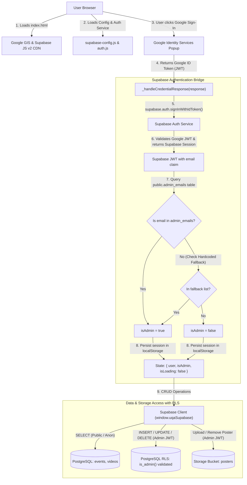
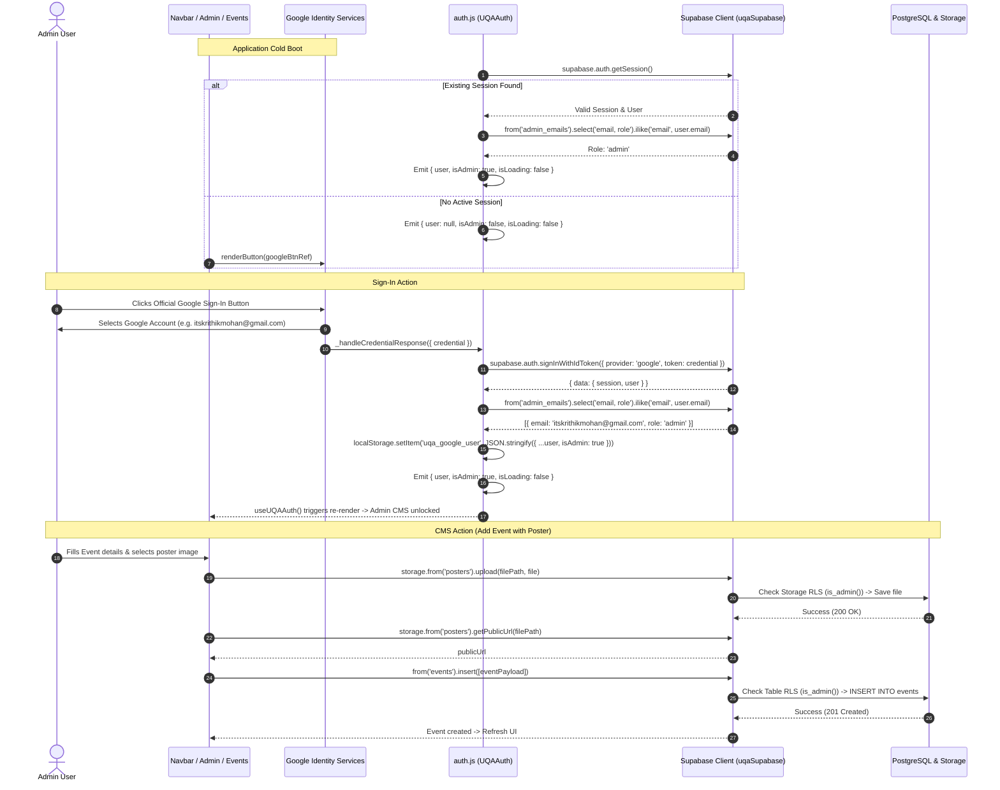

# Plan: Supabase Free Tier Migration (PostgreSQL, Storage & Auth CMS)

## Scope & Objective
Migrate the entire backend from Firebase to Supabase Free Tier (PostgreSQL + Storage + Supabase Auth) with 100% free hosting, 500MB PostgreSQL database, 1GB object storage, and zero credit card requirements.

Bridge Google Identity Services (GIS `gsi/client`) ID tokens into Supabase Auth via `supabase.auth.signInWithIdToken({ provider: 'google', token: response.credential })`. Maintain strict admin authorization for whitelist emails (`itskrithikmohan@gmail.com`, `krithikm@terpmail.umd.edu`, `umd.uqa@gmail.com`) via PostgreSQL Row-Level Security (RLS) policies and client-side fallback. Complete full CRUD for events, poster uploads to Supabase Storage bucket `posters`, and featured YouTube videos for `Resources.js`. Completely eliminate Firebase dependencies (`firebase-config.js`, `firestore.rules`, `storage.rules`, and Firebase CDN script tags).

---

### In Scope
1. **Zero Firebase Elimination**:
   - Remove Firebase v10 Compat SDK CDN script tags (`firebase-app-compat.js`, `firebase-auth-compat.js`, `firebase-firestore-compat.js`, `firebase-storage-compat.js`) from `index.html`.
   - Delete `firebase-config.js`, `firestore.rules`, and `storage.rules`.
   - Purge all Firebase APIs and variables across all components.
2. **Supabase JS v2 UMD CDN Integration**:
   - Load single official Supabase JS v2 script tag `<script src="https://cdn.jsdelivr.net/npm/@supabase/supabase-js@2"></script>` in `index.html`.
   - Create `supabase-config.js` defining `window.UQA_SUPABASE_CONFIG` (`url`, `anonKey`) and `window.isSupabaseConfigured()`.
   - Initialize global Supabase client `window.uqaSupabase`.
3. **PostgreSQL Database Schema & RLS Policies (`supabase-schema.sql`)**:
   - Table `admin_emails` (`email` PK, `role`, `added_by`, `created_at`).
   - Table `videos` (`id` PK, `title`, `category`, `display_order`, `created_at`, `updated_at`).
   - Table `events` (`id` UUID PK, `title`, `subtitle`, `month`, `day`, `year`, `description`, `highlights` JSONB, `links` JSONB, `poster_url`, `poster_path`, `poster_alt`, `is_annual`, `display_order`, `created_at`, `updated_at`).
   - Row-Level Security (RLS) policies enforcing public read and admin-only insert/update/delete based on `auth.jwt() ->> 'email'`.
   - Storage bucket `posters` with 5MB file limit, image mime type validation, public read, and admin-only upload/delete policies.
   - Seed data migration script in SQL.
4. **Google Identity Services (GIS) ↔ Supabase Auth Bridge (`auth.js`)**:
   - Bridge GIS credential into Supabase Auth via `supabase.auth.signInWithIdToken({ provider: 'google', token: response.credential })`.
   - Whitelist verification against `admin_emails` table + fallback to hardcoded list `['itskrithikmohan@gmail.com', 'krithikm@terpmail.umd.edu', 'umd.uqa@gmail.com']`.
   - Persistent session management via Supabase client and `localStorage` (`uqa_google_user`).
   - Reactive `useUQAAuth()` hook providing `{ user, isAdmin, isLoading, error, signOut, renderButton }`.
5. **Dynamic Admin CMS Dashboard (`Admin.js`)**:
   - Event CRUD with poster upload to Supabase Storage bucket `posters`.
   - Video CRUD for Resources page.
   - Whitelist management for `admin_emails`.
   - Database seeding trigger.
6. **Dynamic Resources & Events CMS with Offline Fallback (`Resources.js`, `Events.js`)**:
   - Load dynamic records from Supabase tables with real-time UI updates.
   - Lightbox modal for full-resolution flyer posters in `Events.js`.
   - Graceful offline fallback to hardcoded records if Supabase is unconfigured or network is unavailable.
7. **Branding & UI Consistency (`Navbar.js`, `AuthPortal.js`, `App.js`, `README.md`)**:
   - Update auth indicators and status badges to "Powered by Google & Supabase".
   - Step-by-step Supabase free tier setup documentation in `README.md`.
8. **Git Worktree Isolation**:
   - T0 branch creation on `feature/supabase-cms`; cleanup on final task.

### Out of Scope
- Paid cloud infrastructure, paid Supabase add-ons, or requiring credit card.
- Node.js build tooling (Webpack, Vite) — site remains zero-build browser Babel standalone.
- Modifying static informational pages (`About.js`, `Home.js`, `Contact.js`, `Calendar.js`).

---

## Architecture & Data Flow

### 1. GIS to Supabase Auth & RLS Authorization Flow


### 2. Authentication & Data Sequence Flow


---

## Data Schemas & SQL Specifications

### 1. Supabase Client Configuration (`supabase-config.js`)
```javascript
/**
 * UMD UQA Supabase Client Configuration
 * 100% Free Tier (PostgreSQL + Supabase Storage + Supabase Auth)
 */
window.UQA_SUPABASE_CONFIG = {
  url: "https://YOUR_PROJECT_REF.supabase.co",
  anonKey: "YOUR_SUPABASE_ANON_KEY"
};

/**
 * Check if valid Supabase configuration is set
 */
window.isSupabaseConfigured = function() {
  const cfg = window.UQA_SUPABASE_CONFIG;
  return Boolean(
    cfg &&
    typeof cfg.url === "string" &&
    typeof cfg.anonKey === "string" &&
    cfg.url.startsWith("https://") &&
    !cfg.url.includes("YOUR_PROJECT_REF") &&
    cfg.anonKey.trim() !== "" &&
    !cfg.anonKey.includes("YOUR_SUPABASE_ANON_KEY")
  );
};

// Global Supabase Client Instance
window.uqaSupabase = null;

try {
  if (typeof window.supabase !== "undefined" && window.isSupabaseConfigured()) {
    window.uqaSupabase = window.supabase.createClient(
      window.UQA_SUPABASE_CONFIG.url,
      window.UQA_SUPABASE_CONFIG.anonKey,
      {
        auth: {
          persistSession: true,
          autoRefreshToken: true,
          detectSessionInUrl: true,
          storageKey: 'uqa_supabase_auth_token'
        }
      }
    );
    console.log("[UQA Supabase] Initialized Supabase client successfully.");
  } else {
    console.info("[UQA Supabase] Running in offline fallback mode (credentials unconfigured).");
  }
} catch (err) {
  console.warn("[UQA Supabase] Error initializing Supabase client:", err);
}
```

---

### 2. SQL Schema & RLS Policies (`supabase-schema.sql`)
```sql
-- ====================================================================
-- UMD UQA SUPABASE SCHEMA & SECURITY POLICIES (100% Free Tier)
-- ====================================================================

-- 1. Enable pgcrypto extension for UUID generation
CREATE EXTENSION IF NOT EXISTS "pgcrypto";

-- --------------------------------------------------------------------
-- TABLE: admin_emails
-- --------------------------------------------------------------------
CREATE TABLE IF NOT EXISTS public.admin_emails (
    email TEXT PRIMARY KEY,
    role TEXT NOT NULL DEFAULT 'admin',
    added_by TEXT DEFAULT 'system_bootstrap',
    created_at TIMESTAMPTZ NOT NULL DEFAULT now()
);

-- --------------------------------------------------------------------
-- TABLE: videos
-- --------------------------------------------------------------------
CREATE TABLE IF NOT EXISTS public.videos (
    id TEXT PRIMARY KEY, -- YouTube Video ID
    title TEXT NOT NULL,
    category TEXT NOT NULL DEFAULT 'Featured Videos',
    display_order INTEGER NOT NULL DEFAULT 1,
    created_at TIMESTAMPTZ NOT NULL DEFAULT now(),
    updated_at TIMESTAMPTZ NOT NULL DEFAULT now()
);

-- --------------------------------------------------------------------
-- TABLE: events
-- --------------------------------------------------------------------
CREATE TABLE IF NOT EXISTS public.events (
    id UUID PRIMARY KEY DEFAULT gen_random_uuid(),
    title TEXT NOT NULL,
    subtitle TEXT DEFAULT '',
    month TEXT NOT NULL,
    day TEXT NOT NULL,
    year TEXT NOT NULL,
    description TEXT NOT NULL,
    highlights JSONB NOT NULL DEFAULT '[]'::jsonb,
    links JSONB NOT NULL DEFAULT '[]'::jsonb,
    poster_url TEXT DEFAULT '',
    poster_path TEXT DEFAULT '',
    poster_alt TEXT DEFAULT '',
    is_annual BOOLEAN NOT NULL DEFAULT false,
    display_order INTEGER NOT NULL DEFAULT 1,
    created_at TIMESTAMPTZ NOT NULL DEFAULT now(),
    updated_at TIMESTAMPTZ NOT NULL DEFAULT now()
);

-- --------------------------------------------------------------------
-- ROW LEVEL SECURITY (RLS) CONFIGURATION
-- --------------------------------------------------------------------
ALTER TABLE public.admin_emails ENABLE ROW LEVEL SECURITY;
ALTER TABLE public.videos ENABLE ROW LEVEL SECURITY;
ALTER TABLE public.events ENABLE ROW LEVEL SECURITY;

-- Helper Function: Check if current authenticated user is an authorized admin
CREATE OR REPLACE FUNCTION public.is_admin()
RETURNS BOOLEAN AS $$
BEGIN
  RETURN EXISTS (
    SELECT 1 FROM public.admin_emails
    WHERE lower(email) = lower(auth.jwt() ->> 'email')
  );
END;
$$ LANGUAGE plpgsql SECURITY DEFINER;

-- Policies: admin_emails
DROP POLICY IF EXISTS "Allow public read admin_emails" ON public.admin_emails;
CREATE POLICY "Allow public read admin_emails"
    ON public.admin_emails FOR SELECT
    TO anon, authenticated
    USING (true);

DROP POLICY IF EXISTS "Allow admin manage admin_emails" ON public.admin_emails;
CREATE POLICY "Allow admin manage admin_emails"
    ON public.admin_emails FOR ALL
    TO authenticated
    USING (public.is_admin())
    WITH CHECK (public.is_admin());

-- Policies: videos
DROP POLICY IF EXISTS "Allow public read videos" ON public.videos;
CREATE POLICY "Allow public read videos"
    ON public.videos FOR SELECT
    TO anon, authenticated
    USING (true);

DROP POLICY IF EXISTS "Allow admin manage videos" ON public.videos;
CREATE POLICY "Allow admin manage videos"
    ON public.videos FOR ALL
    TO authenticated
    USING (public.is_admin())
    WITH CHECK (public.is_admin());

-- Policies: events
DROP POLICY IF EXISTS "Allow public read events" ON public.events;
CREATE POLICY "Allow public read events"
    ON public.events FOR SELECT
    TO anon, authenticated
    USING (true);

DROP POLICY IF EXISTS "Allow admin manage events" ON public.events;
CREATE POLICY "Allow admin manage events"
    ON public.events FOR ALL
    TO authenticated
    USING (public.is_admin())
    WITH CHECK (public.is_admin());

-- --------------------------------------------------------------------
-- STORAGE BUCKET: posters
-- --------------------------------------------------------------------
INSERT INTO storage.buckets (id, name, public, file_size_limit, allowed_mime_types)
VALUES (
    'posters',
    'posters',
    true,
    5242880, -- 5MB limit
    ARRAY['image/png', 'image/jpeg', 'image/jpg', 'image/webp', 'image/gif']
)
ON CONFLICT (id) DO UPDATE SET
    public = true,
    file_size_limit = 5242880,
    allowed_mime_types = ARRAY['image/png', 'image/jpeg', 'image/jpg', 'image/webp', 'image/gif'];

-- Storage RLS Policies
DROP POLICY IF EXISTS "Allow public read posters" ON storage.objects;
CREATE POLICY "Allow public read posters"
    ON storage.objects FOR SELECT
    TO anon, authenticated
    USING (bucket_id = 'posters');

DROP POLICY IF EXISTS "Allow admin upload posters" ON storage.objects;
CREATE POLICY "Allow admin upload posters"
    ON storage.objects FOR INSERT
    TO authenticated
    WITH CHECK (bucket_id = 'posters' AND public.is_admin());

DROP POLICY IF EXISTS "Allow admin update posters" ON storage.objects;
CREATE POLICY "Allow admin update posters"
    ON storage.objects FOR UPDATE
    TO authenticated
    USING (bucket_id = 'posters' AND public.is_admin());

DROP POLICY IF EXISTS "Allow admin delete posters" ON storage.objects;
CREATE POLICY "Allow admin delete posters"
    ON storage.objects FOR DELETE
    TO authenticated
    USING (bucket_id = 'posters' AND public.is_admin());

-- --------------------------------------------------------------------
-- SEED INITIAL DATA
-- --------------------------------------------------------------------
-- 1. Initial Admin Whitelist
INSERT INTO public.admin_emails (email, role, added_by) VALUES
    ('itskrithikmohan@gmail.com', 'admin', 'initial_setup'),
    ('krithikm@terpmail.umd.edu', 'admin', 'initial_setup'),
    ('umd.uqa@gmail.com', 'admin', 'initial_setup')
ON CONFLICT (email) DO NOTHING;

-- 2. Initial Featured Videos
INSERT INTO public.videos (id, title, category, display_order) VALUES
    ('agOdzgWTr-Y', 'QuEra Workshop 1', 'Featured Videos', 1),
    ('i_MKOCxInOQ', 'QuEra Quantum Challenge Walkthrough', 'Featured Videos', 2),
    ('xEa3WIzgxDQ', 'QuEra Workshop 2', 'Featured Videos', 3)
ON CONFLICT (id) DO NOTHING;

-- 3. Initial Annual Event (QLCN)
INSERT INTO public.events (
    title, subtitle, month, day, year, description, highlights, links, is_annual, display_order
) VALUES (
    'Quantum Leap Career Nexus',
    'QLCN 2026 · University of Maryland',
    'Sept',
    '15',
    '2026',
    'A career fair and professional development event bringing together quantum computing students, researchers, and industry professionals. QLCN connects tomorrow''s quantum workforce with leading organizations through networking, recruitment, and mentorship workshops.',
    '["Networking with quantum industry professionals and recruiters", "Workshops focused on internship and job placement", "Career development and mentorship opportunities for undergraduates"]'::jsonb,
    '[{"label": "Register via Handshake", "url": "https://go.umd.edu/QLCNregister", "primary": true}, {"label": "Register without Handshake", "url": "https://go.umd.edu/attendQLCN", "primary": false}]'::jsonb,
    true,
    1
)
ON CONFLICT DO NOTHING;
```

---

## Tasks

### T0: Create isolated git worktree
- **Deps**: None
- **Est. Time**: 3 min
- **Files**: None
- **Action**:
  - Caveman: Make new worktree for supabase migration. Run `git worktree add ../worktree-supabase-cms -b feature/supabase-cms`. Switch directory to `../worktree-supabase-cms`.
  - Verify clean working tree on isolated branch.
- **Acceptance Criteria**:
  - `git worktree list` displays `../worktree-supabase-cms` on branch `feature/supabase-cms`.
- **Tests**:
  - *Happy*: Worktree directory created and active.
  - *Edge*: Worktree folder exists from prior run -> cleans up or reuses.
  - *Error*: Git errors handled if branch name conflicts.

---

### T1: Strip Firebase SDKs and integrate Supabase JS v2 in `index.html`
- **Deps**: T0
- **Est. Time**: 10 min
- **Files**:
  - `index.html`
- **Action**:
  - Caveman: Edit `index.html`. Delete all Firebase v10 Compat CDN tags (`firebase-app-compat.js`, `firebase-auth-compat.js`, `firebase-firestore-compat.js`, `firebase-storage-compat.js`). Add single Supabase JS v2 script tag `<script src="https://cdn.jsdelivr.net/npm/@supabase/supabase-js@2"></script>`. Replace `firebase-config.js` with `supabase-config.js`. Keep Google Identity Services (GIS) SDK.
  - Script loading sequence in `index.html`:
    1. React 18 & ReactDOM UMD
    2. Babel Standalone & Tailwind CDN
    3. Supabase JS v2 CDN (`@supabase/supabase-js@2`)
    4. Google Identity Services SDK (`https://accounts.google.com/gsi/client`)
    5. `supabase-config.js`
    6. `google-auth-config.js`
    7. `auth.js`
    8. UI Components (`Navbar.js`, `Home.js`, `About.js`, `Events.js`, `Contact.js`, `Calendar.js`, `Resources.js`, `AuthPortal.js`, `Admin.js`)
    9. `App.js`
- **Acceptance Criteria**:
  - Zero Firebase script tags in `index.html`.
  - Supabase JS v2 CDN loaded; `window.supabase` is defined on window before app code runs.
  - Zero 404 network errors in browser console.
- **Tests**:
  - *Happy*: Open `index.html`; `typeof window.supabase.createClient === 'function'`.
  - *Edge*: Slow network simulation loads Supabase before app scripts without race conditions.
  - *Error*: Missing script tags or bad URLs caught and logged clearly.

---

### T2: Create `supabase-config.js` and delete Firebase config and rules files
- **Deps**: T1
- **Est. Time**: 10 min
- **Files**:
  - `supabase-config.js` (create)
  - `firebase-config.js` (delete)
  - `firestore.rules` (delete)
  - `storage.rules` (delete)
- **Action**:
  - Caveman: Create `supabase-config.js` with `window.UQA_SUPABASE_CONFIG` (`url`, `anonKey`), `window.isSupabaseConfigured()`, and client initialization into `window.uqaSupabase`. Delete `firebase-config.js`, `firestore.rules`, and `storage.rules` from filesystem.
  - Provide clear setup instructions in comments explaining how to get free Project URL and Anon Public Key from Supabase Dashboard.
- **Acceptance Criteria**:
  - `supabase-config.js` created and sets `window.uqaSupabase` when valid keys present.
  - `window.isSupabaseConfigured()` returns `false` on placeholders and `true` on valid URL + key.
  - `firebase-config.js`, `firestore.rules`, `storage.rules` deleted.
- **Tests**:
  - *Happy*: Default placeholder config returns `isSupabaseConfigured() === false` without throwing errors.
  - *Edge*: Malformed URL (missing `https://`) returns `false`.
  - *Happy*: Deleted Firebase files are absent in `git status`.

---

### T3: Create `supabase-schema.sql` with PostgreSQL DDL, RLS and Seed Data
- **Deps**: T2
- **Est. Time**: 15 min
- **Files**:
  - `supabase-schema.sql` (create)
- **Action**:
  - Caveman: Create `supabase-schema.sql` file in project root. Include table definitions for `admin_emails`, `videos`, `events`. Add `is_admin()` security definer function. Add RLS policies for public select and admin-only insert/update/delete. Add `posters` storage bucket definition with 5MB limit and image mime-type check. Add seed data for admins (`itskrithikmohan@gmail.com`, `krithikm@terpmail.umd.edu`, `umd.uqa@gmail.com`), default videos, and QLCN event.
- **Acceptance Criteria**:
  - SQL syntax valid for PostgreSQL 15+ (Supabase).
  - All RLS policies correctly check `public.is_admin()`.
  - Storage bucket `posters` configured with RLS and public read.
- **Tests**:
  - *Happy*: SQL script can be executed cleanly in Supabase SQL Editor in one paste.
  - *Edge*: Re-running script uses `IF NOT EXISTS` and `ON CONFLICT DO NOTHING` without failing.

---

### T4: Implement GIS to Supabase Auth bridge & whitelist verification in `auth.js`
- **Deps**: T2, T3
- **Est. Time**: 25 min
- **Files**:
  - `auth.js`
- **Action**:
  - Caveman: Rewrite `auth.js`. Eliminate all Firebase code. In `_handleCredentialResponse(response)`, call `window.uqaSupabase.auth.signInWithIdToken({ provider: 'google', token: response.credential })`. Extract user info (`uid`, `email`, `displayName`, `photoURL`). Check admin status in `admin_emails` table via `window.uqaSupabase.from('admin_emails').select('role').ilike('email', email)`. If offline or table empty, check client fallback whitelist (`['itskrithikmohan@gmail.com', 'krithikm@terpmail.umd.edu', 'umd.uqa@gmail.com']`). Update `signOut()` to call `supabase.auth.signOut()` and `google.accounts.id.disableAutoSelect()`.
  - Session Restoration:
    - Listen to `supabase.auth.onAuthStateChange` to sync session state on reload or token refresh.
    - Fallback: parse `localStorage.getItem('uqa_google_user')` on cold boot for instant UI rendering without flicker.
- **Acceptance Criteria**:
  - GIS ID Token successfully authenticates user with Supabase Auth.
  - Whitelisted emails receive `isAdmin: true`; non-whitelisted Google users receive `isAdmin: false`.
  - Session persists across page reloads (`F5`).
  - `signOut()` removes session from Supabase, GIS, and `localStorage`.
  - Zero Firebase references remain in `auth.js`.
- **Tests**:
  - *Happy*: Whitelisted admin signs in -> Supabase Auth session active -> `isAdmin: true`.
  - *Happy*: Non-admin Google user signs in -> `user` populated -> `isAdmin: false`.
  - *Happy*: Page refresh (`F5`) restores user and admin state in <50ms.
  - *Edge*: Offline or unconfigured Supabase falls back to JWT decode and hardcoded admin list.
  - *Error*: Expired or corrupted token handled gracefully with retry prompt.

---

### T5: Update Admin CMS Dashboard (`Admin.js`) for Supabase PostgreSQL & Storage
- **Deps**: T4
- **Est. Time**: 30 min
- **Files**:
  - `Admin.js`
- **Action**:
  - Caveman: Update `Admin.js` to use `window.uqaSupabase`. Replace all Firestore/Firebase Storage calls with Supabase Client methods:
    - Events: `supabase.from('events').select('*').order('display_order', { ascending: true })`
    - Videos: `supabase.from('videos').select('*').order('display_order', { ascending: true })`
    - Admins: `supabase.from('admin_emails').select('*').order('created_at', { ascending: true })`
    - Poster Upload: `supabase.storage.from('posters').upload(filePath, file)` -> `supabase.storage.from('posters').getPublicUrl(filePath)`
    - Poster Delete: `supabase.storage.from('posters').remove([posterPath])`
    - Event CRUD: `insert()`, `update().eq('id', id)`, `delete().eq('id', id)`
    - Video CRUD: `upsert()`, `delete().eq('id', id)`
    - Whitelist CRUD: `insert()`, `delete().eq('email', email)` with self-deletion safeguard.
  - Update branding text in guest and restricted views to "Powered by Google & Supabase".
- **Acceptance Criteria**:
  - Admin dashboard loads events, videos, and whitelist from Supabase PostgreSQL tables.
  - Event creation with image uploads file to Supabase `posters` bucket and saves `poster_url`.
  - Event deletion removes database row and purges file from Supabase Storage.
  - Video and whitelist CRUD functional.
  - Zero Firebase references remain in `Admin.js`.
- **Tests**:
  - *Happy (Event CRUD)*: Admin creates event with poster -> edits title -> deletes event (storage purged) -> UI updates.
  - *Happy (Poster Upload)*: 2MB PNG uploaded to `posters` bucket; public URL generated.
  - *Edge (Admin Safeguard)*: Admin cannot delete their own active email from whitelist table.
  - *Error*: Uploading >5MB file displays immediate client-side validation error.

---

### T6: Update Resources CMS with Supabase queries & fallback (`Resources.js`)
- **Deps**: T4, T5
- **Est. Time**: 20 min
- **Files**:
  - `Resources.js`
- **Action**:
  - Caveman: Update `Resources.js` to fetch featured videos from Supabase `videos` table (`display_order` asc). Replace Firestore inline CRUD with `window.uqaSupabase.from('videos')`. If Supabase unconfigured or offline, fall back to `defaultVideoResources`.
  - Support YouTube URL parsing (both `youtu.be/ID` and `youtube.com/watch?v=ID`).
  - Keep inline "+ Add Video", "Edit", and "Delete" buttons visible only when `auth.isAdmin === true`.
- **Acceptance Criteria**:
  - Video list loaded from Supabase `videos` table.
  - Admin can add and delete videos inline.
  - Offline fallback preserves full default video playlist.
  - Zero Firebase references remain in `Resources.js`.
- **Tests**:
  - *Happy*: Videos fetch from Supabase and render in tab bar; active video embeds player.
  - *Happy*: Admin adds new video URL -> saved to Supabase -> new tab appears immediately.
  - *Edge*: Supabase network error falls back cleanly to hardcoded videos.

---

### T7: Update Events CMS, Poster Lightbox & CRUD (`Events.js`)
- **Deps**: T4, T5
- **Est. Time**: 25 min
- **Files**:
  - `Events.js`
- **Action**:
  - Caveman: Update `Events.js` to load events from Supabase `events` table (`display_order` asc). Replace Firestore calls and storage uploads with `window.uqaSupabase.from('events')` and `window.uqaSupabase.storage.from('posters')`.
  - Map snake_case DB columns (`poster_url`, `poster_path`, `poster_alt`, `is_annual`, `display_order`) to component state with backwards compatibility.
  - Keep Poster Lightbox modal with click-to-enlarge, `Esc` key listener, and backdrop click to close.
  - Keep inline event CRUD controls for `auth.isAdmin`.
  - Fallback to `defaultAnnualEvents` (QLCN) if Supabase is offline or empty.
- **Acceptance Criteria**:
  - Events fetched from Supabase PostgreSQL table.
  - Flyer posters render thumbnail and open full-screen Lightbox on click.
  - Admin can add, edit, and delete events with poster uploads directly on Events page.
  - Zero Firebase references remain in `Events.js`.
- **Tests**:
  - *Happy (Lightbox)*: Clicking event poster flyer opens high-res Lightbox modal; pressing `Esc` closes it.
  - *Happy (Inline CRUD)*: Admin adds event with poster flyer -> poster stored in `posters` bucket -> card renders on page.
  - *Edge*: Event without poster renders clean card without broken image layout.
  - *Error*: Network drop falls back to hardcoded QLCN event seamlessly.

---

### T8: Update UI text, AuthPortal & Navbar (`AuthPortal.js`, `Navbar.js`, `App.js`)
- **Deps**: T4
- **Est. Time**: 15 min
- **Files**:
  - `AuthPortal.js`
  - `Navbar.js`
  - `App.js`
- **Action**:
  - Caveman: Update `AuthPortal.js`, `Navbar.js`, and `App.js`. Update footer and badge text to "Powered by Google & Supabase". In `AuthPortal.js`, update configuration help text to reference `supabase-config.js` and `google-auth-config.js`. Ensure provider metadata shows "Google + Supabase Auth".
  - Verify route `#admin` and `#auth` transition cleanly.
  - Check for any leftover Firebase strings or comments.
- **Acceptance Criteria**:
  - All UI elements reference Google & Supabase (zero mention of Firebase).
  - Navbar reflects user avatar and admin shortcut button smoothly.
- **Tests**:
  - *Happy*: Guest visits `#auth` -> GIS button renders -> text displays "Google & Supabase".
  - *Happy*: Admin clicks Navbar avatar -> navigates to `#admin`.

---

### T9: Update Documentation (`README.md`) for Supabase Free Tier Setup
- **Deps**: T8
- **Est. Time**: 10 min
- **Files**:
  - `README.md`
- **Action**:
  - Caveman: Update `README.md`. Remove Firebase instructions completely. Add step-by-step Supabase Free Tier Setup Guide:
    1. Create free project on [supabase.com](https://supabase.com) (no credit card).
    2. Run `supabase-schema.sql` in SQL Editor.
    3. Configure Google Auth provider in Supabase Dashboard (enable Google, enter Client ID from `google-auth-config.js`).
    4. Copy Project URL and Anon Public Key into `supabase-config.js`.
    5. Test admin sign-in with whitelisted emails.
- **Acceptance Criteria**:
  - `README.md` is 100% accurate, free-tier focused, and free of Firebase references.
- **Tests**:
  - *Happy*: New developer can follow README to set up Supabase backend in under 5 minutes.

---

### T10: End-to-End Verification Protocol & Offline Fallback Testing
- **Deps**: T1, T2, T3, T4, T5, T6, T7, T8, T9
- **Est. Time**: 20 min
- **Files**:
  - `index.html`
  - `supabase-config.js`
  - `supabase-schema.sql`
  - `auth.js`
  - `Admin.js`
  - `Events.js`
  - `Resources.js`
  - `AuthPortal.js`
  - `Navbar.js`
  - `App.js`
- **Action**:
  - Caveman: Serve app locally (`python3 -m http.server 8000`). Run full test suite:
    1. **Codebase Grep**: Run `grep -ri "firebase" .` and confirm zero active Firebase SDK/config code remains.
    2. **Guest View**: Open `http://localhost:8000/#events` and `/#resources`. Verify fallback data renders cleanly.
    3. **Sign-In Flow**: Click Google Sign-In with whitelisted email (`itskrithikmohan@gmail.com`). Verify Supabase Auth token exchange and `isAdmin: true`.
    4. **CMS CRUD**: Add event with poster image flyer; verify PostgreSQL row created and poster stored in `posters` bucket. Verify Lightbox opens flyer poster.
    5. **Video CRUD**: Add new YouTube video in Resources; verify video tab appears and plays.
    6. **Sign Out**: Sign out; verify session purged and UI returns to guest mode.
    7. **Offline Simulation**: Set DevTools to Offline; verify zero crashes and graceful fallback.
- **Acceptance Criteria**:
  - Zero Firebase traces.
  - All happy path and edge cases pass without console errors.
- **Tests**:
  - *Happy*: All 7 test verification steps succeed.
  - *Edge*: Offline mode keeps entire website navigable.

---

### T11: Commit changes & cleanup git worktree
- **Deps**: T10
- **Est. Time**: 5 min
- **Files**:
  - All modified files
- **Action**:
  - Caveman: In worktree directory, stage and commit all changes:
    `git add . && git commit -m "feat(cms): migrate from firebase to supabase free tier postgresql storage and auth"`
  - Switch back to main repository root: `cd /home/bobjoe/IdeaProjects/umd-uqa.github.io`
  - Remove worktree: `git worktree remove ../worktree-supabase-cms`
- **Acceptance Criteria**:
  - Clean commit on `feature/supabase-cms`.
  - Worktree directory `../worktree-supabase-cms` cleanly removed.
- **Tests**:
  - *Happy*: `git worktree list` confirms worktree cleanup; main branch clean.

---

## Step-by-Step Supabase Project Setup Guide

### Step 1: Create Free Supabase Project (No Credit Card)
1. Go to [https://supabase.com](https://supabase.com) and sign in with GitHub or email.
2. Click **New Project**.
3. Set **Name**: `umd-uqa-web`
4. Set **Database Password**: (Generate and save secure password).
5. Choose **Region**: `US East (N. Virginia) [us-east-1]` (closest to UMD).
6. Select **Pricing Plan**: **Free ($0/month)**.
7. Click **Create new project** (takes ~60 seconds to provision).

### Step 2: Execute Schema & RLS Policies
1. In Supabase Dashboard, click **SQL Editor** on the left menu.
2. Click **+ New Query**.
3. Open `supabase-schema.sql` from this repository, copy the entire SQL script, and paste into the editor.
4. Click **Run** (or `Ctrl+Enter`).
5. Confirm tables `admin_emails`, `videos`, `events`, and storage bucket `posters` are created.

### Step 3: Enable Google Authentication Provider in Supabase
1. In Supabase Dashboard, go to **Authentication** > **Providers**.
2. Click **Google**.
3. Toggle **Enable Sign in with Google** to **ON**.
4. Enter **Client ID**: Paste `window.UQA_GOOGLE_CLIENT_ID` (from `google-auth-config.js`, e.g. `998330975634-611hfe3fmsgokccgr913v7md908cdidv.apps.googleusercontent.com`).
5. Toggle **Skip nonce check** if using client-side GIS ID token exchange.
6. Click **Save**.

### Step 4: Configure Client Credentials in Codebase
1. In Supabase Dashboard, go to **Project Settings** (gear icon) > **API**.
2. Copy **Project URL** (e.g. `https://xyzcompany.supabase.co`).
3. Copy **Project API Keys** > `anon` `public` key (e.g. `eyJhbGciOi...`).
4. Open `supabase-config.js` in the repository and paste:
   ```javascript
   window.UQA_SUPABASE_CONFIG = {
     url: "https://your-project-ref.supabase.co",
     anonKey: "eyJhbGciOi..."
   };
   ```

---

## Error Scenarios & Resiliency Matrix

| Error Scenario | Root Cause | Detection Point | Automated Recovery / UI Mitigation |
| :--- | :--- | :--- | :--- |
| **Unconfigured Supabase Keys** | Default placeholder in `supabase-config.js` | `window.isSupabaseConfigured()` returns `false` | Fall back to client-side offline mode; use hardcoded videos and events without white screen crash. |
| **Supabase DB Offline / Network Failure** | Network disconnected or Supabase outage | `supabase.from().select()` returns error or throws | Catch error in `useEffect`, log warning, and render fallback default data with offline status pill. |
| **Non-Whitelisted Google User** | User logged in with unauthorized Google account | `admin_emails` query returns 0 rows and email not in fallback list | Set `isAdmin = false`; render User Profile Card with "Member (Read Only)" status; prevent CMS controls. |
| **Poster File Size > 5MB** | User selects large raw image flyer | Client validation `file.size > 5 * 1024 * 1024` and Storage RLS | Client displays immediate error modal: "File exceeds 5MB limit. Please compress image."; blocks upload. |
| **Unsupported Poster MIME Type** | User selects PDF or executable | `!['image/png', 'image/jpeg', 'image/webp', 'image/gif'].includes(file.type)` | Client displays error modal: "Only PNG, JPEG, WebP, and GIF images are supported."; blocks upload. |
| **RLS Permission Denied** | Tampered client attempting unauthorized write | Supabase PostgreSQL returns error code `42501` (insufficient_privilege) | Display user-friendly notification: "Action denied: Administrator privileges required."; keep database safe. |
| **Accidental Admin Self-Deletion** | Admin tries to delete their own email from whitelist | `Admin.js` check `email.toLowerCase() === auth.user.email.toLowerCase()` | UI disables delete button on current user row and displays tooltip: "Cannot remove your own admin status". |

---

## Verification Test Matrix

| Step | Test Scenario | Action / Input | Expected Result | Pass Criteria |
| :--- | :--- | :--- | :--- | :--- |
| **Step 1** | Zero Firebase Check | Run `grep -ri "firebase" .` across codebase | Zero active Firebase SDK script tags, config objects, or API calls found. | Exit code 0 on clean grep |
| **Step 2** | Cold Guest Load | Open `http://localhost:8000/#events` | Default events render with Lightbox capability. Zero console errors. | `events.length >= 1`, Lightbox works |
| **Step 3** | Google Auth Sign-In | Click Google Sign-In with `itskrithikmohan@gmail.com` | GIS returns ID token -> Supabase Auth issues session -> `isAdmin: true`. | `auth.isAdmin === true` |
| **Step 4** | Non-Admin Sign-In | Sign in with non-whitelisted Google account | User authenticated but `isAdmin === false`. Access restricted card on `#admin`. | `auth.user != null`, `isAdmin === false` |
| **Step 5** | Event CRUD + Poster | Admin creates event with poster flyer image | Poster uploaded to `posters` bucket; event inserted in PostgreSQL; card updates. | Event visible with flyer thumbnail |
| **Step 6** | Flyer Poster Lightbox | Click poster flyer thumbnail on event card | Full-resolution modal opens with dark backdrop blur; `Esc` closes modal. | Lightbox opens and closes smoothly |
| **Step 7** | Video CMS CRUD | Admin adds YouTube URL on Resources page | Video record inserted in Supabase `videos` table; active tab switches to new video. | New video tab playable |
| **Step 8** | Whitelist Management | Admin adds `officer@umd.edu` to whitelist | Row inserted in `admin_emails`; self-deletion of active user is blocked. | New admin saved; safeguard verified |
| **Step 9** | Session Reload | Press `F5` / Reload browser page | Session restored instantly from Supabase/localStorage without layout shift. | User remains admin on reload (<50ms) |
| **Step 10** | Offline Resilience | Toggle Network to Offline in DevTools | App remains fully operational with fallback data; zero unhandled promise rejections. | No broken UI or white screen |

---

## Test Strategy
- **Zero Firebase Static Audit**: Grep entire repository for `firebase` and ensure all legacy scripts, rules, and variables are eliminated.
- **SQL & RLS Security Audit**: Verify `supabase-schema.sql` enforces `is_admin()` on all write operations across tables and storage objects.
- **Authentication Resilience**: Test GIS token exchange with Supabase Auth, session restoration on cold boot, and clean sign-out.
- **Storage & Lightbox Testing**: Test flyer uploads (<5MB), public URL retrieval, flyer replacement, automatic cleanup on deletion, and responsive Lightbox modal.
- **Offline Fallback Validation**: Disconnect network to verify that public visitors can still view hardcoded events and videos without UI disruption.
